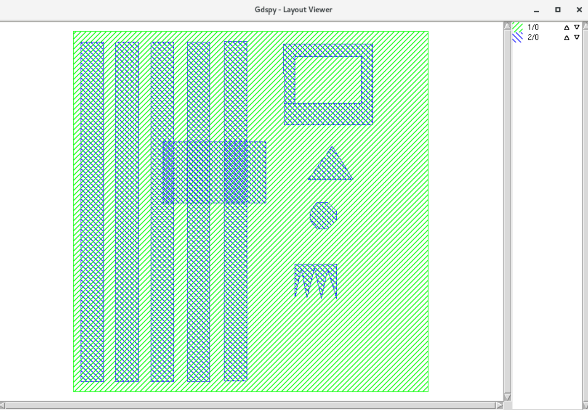
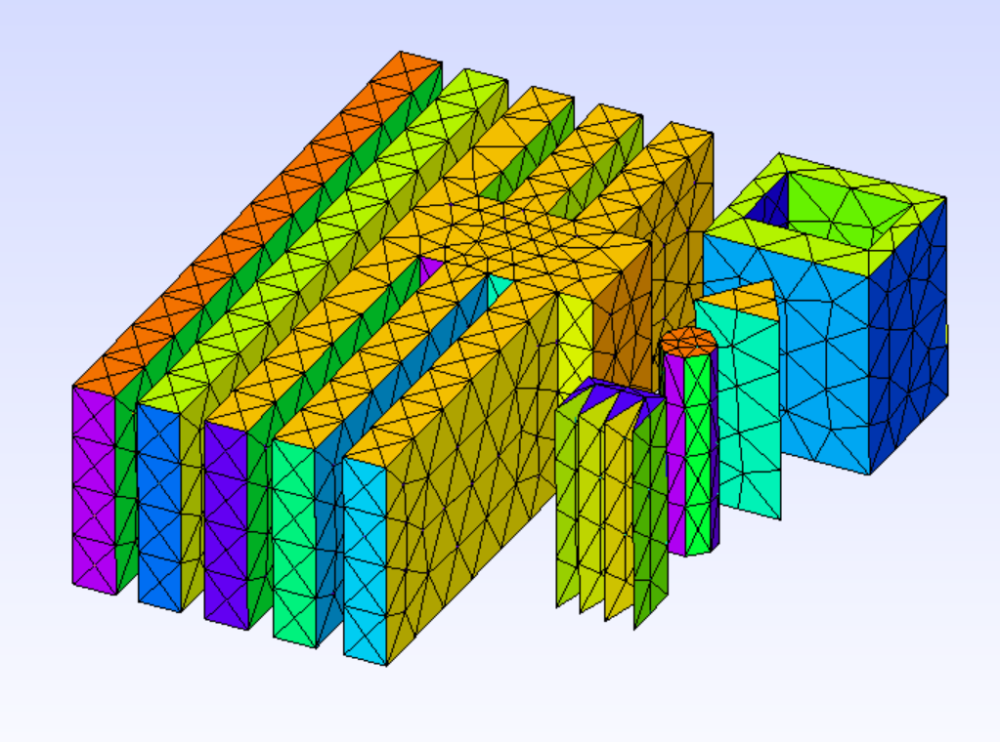

# gmsh-gds-import


## About
This repo allows to import .gds file inside a GMSH mesh. It uses the [gdspy](https://gdspy.readthedocs.io/en/stable/#) python library in order to read the gds file. 

## Dependencies
Dependencies are the following:
```python
gdspy==1.6.12
numpy==1.22.4
gmsh=4.10.3=hc719622_0
# python-gmsh=4.10.3 (for conda environment only)
python3-tk package (sudo apt install python3-tk) for the test test0_View only.
```

In order to run the test you must add the ./src folder to your PYTHONPATH.

## Test

#### View 
Type,

```python
python3 test/test0_View.py
```
in order to visualize with python3-tk the input gds informations. Basically you'll get:



#### Read 
Type,

```python
python3 test/test1_Read.py
```
in order to display informations shown on test0_View directly on the console.

#### Build 
Type,

```python
python3 test/test2_Build_extrude.py
```
in order to actually build a basic mesh involving all polygons of layer 2, datatype 0.





